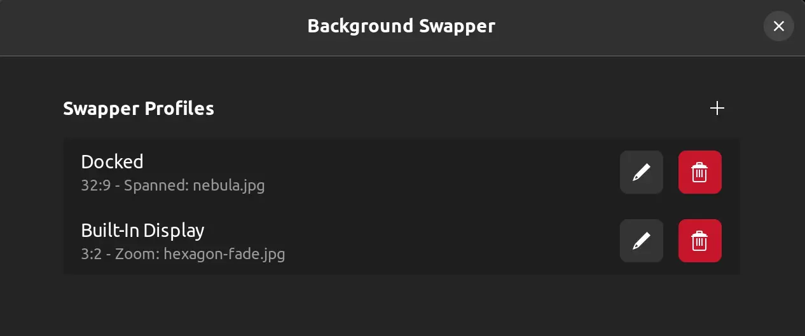
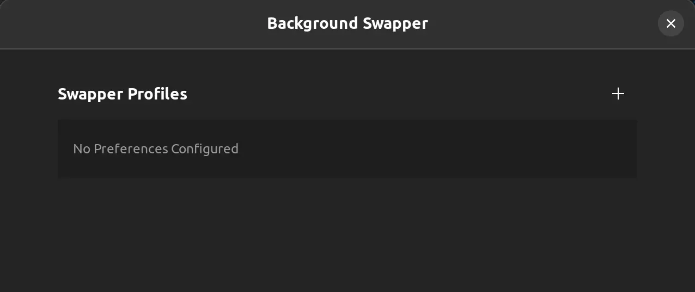

# Background Swapper

Background swapper is a GNOME Shell Extension where you can set up profiles to automatically swap your desktop background based on the aspect ratio of the total area of the display in use.

This can be useful for laptops where you might want to use one background when docked to an ultrawide or multi-monitor setup but a different background when on the go and using only the built-in display.

---

## Installation

To install this extension manually you will need:

-   GNOME 42+
-   A Typescript Compiler (`tsc`)

To build and install locally run `scripts/install.sh`

## How to Use Background Swapper

Open the extension Settings dialog:

Click the + at the top right to add a new preference:

Fill out the following information:

-   Name - A descriptor for the profile for easy identification
-   Width - The width ratio upon which to trigger this profile
-   Height - The height ratio upon which to trigger this profile
-   Background Style - The adjustment to apply to the image when the image dimensions do not match monitor dimensions. Spanned will span the image across the total display area.
-   Image - Select the image file to use for the desktop background

Click "Apply" and repeat for any additional aspect ratios you would like to configure a profile for.

Enable the extension, and it will begin waiting for a display change. If the display changes dimensions and there's a profile associated with the new aspect ratio, it will apply the settings in that profile.

## License

Licensed under the GNU General Public License, Version 3.0 ([LICENSE](LICENSE) or https://www.gnu.org/licenses/gpl-3.0.en.html)

## Developers

This extension is written in [TypeScript](https://www.typescriptlang.org/) and transpiled to JavaScript. The resulting transpiled JavaScript contains module imports, which are not understood by the GJS API and must be replaced with `Me.imports.[module]` statements. This is done in the `build.sh` script.

Minimal API (only the interfaces that the extension interacts with) is declared in the .d.ts (TypeScript Declaration) files.

### Contributions

Any contributions intentionally submitted for inclusion in this work by you shall be licensed under the same GNU GPLv3.
